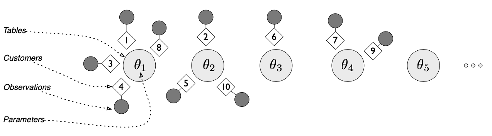

# Chinese Restaurant Process Simulation
###### Jack Potrykus & Ruben Abbou
###### STAT 35450 - Computational Biology
###### Winter 2021

## Motivation

The Chinese Restaurant Process (CRP) is a Bayesian nonparametric method which can be used to cluster microarray gene expression data. Many of the successful techniques which have proven to work for this type of data (such as EXAMPLES) rely on previous knowledge about the data such as the number of clusters. This can be problematic as microarray data may contain important fluctuation and we may not always know the number of clusters we aim to separate. The CRP provides an alternative method which does not require prior knowledge on the data, and assumes an infinite number of latent clusters.

## Method

Imagine a restaurant with an infinite number of tables, and imagine a sequence of customers entering the restaurant and sitting down. The first customer enters and sits at the first table. The second customer enters and sits at the first table with probability $\frac{1}{1+\alpha}$, and the second table with probability $\frac{1}{1+\alpha}$, where $\alpha$ is a positive real. When the $n$th customer enters the restaurant, she sits at each of the occupied tables with probability proportional to the number of previous customers sitting there, and at the next unoccupied table with probability proportional to $\alpha$. At any point in this process, the assignment of customers to tables defines a random partition.

## Examples

## Exercises

#### Sources
