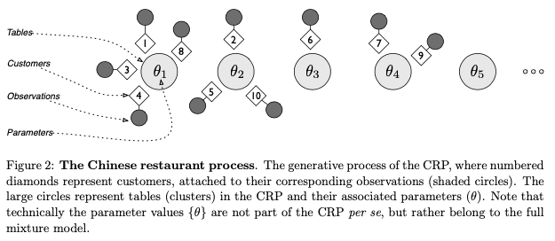
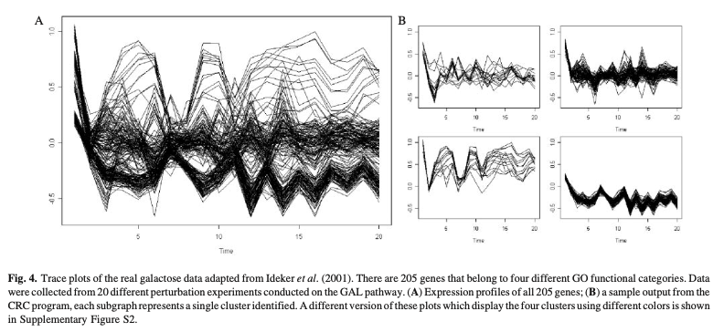
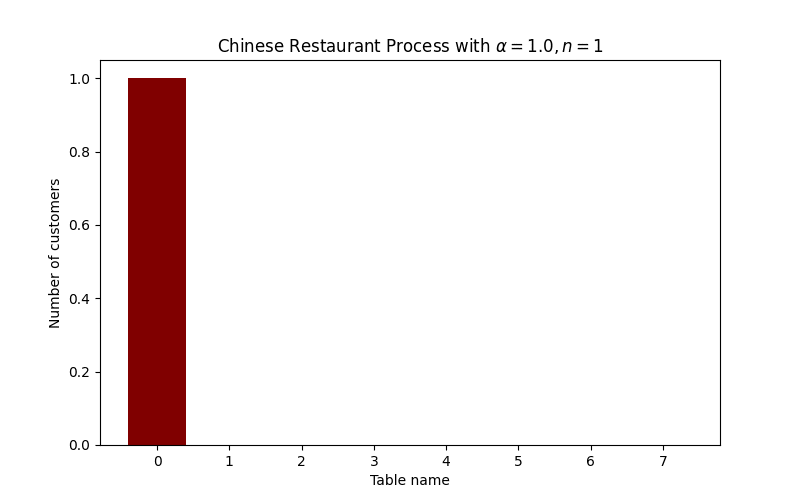
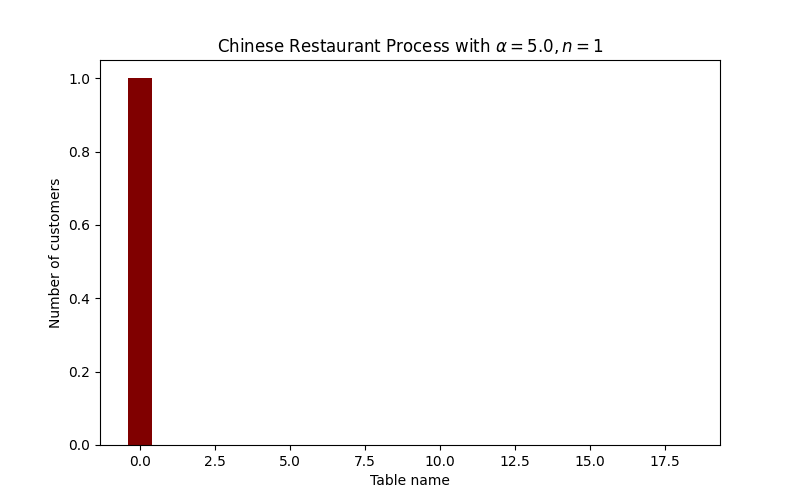
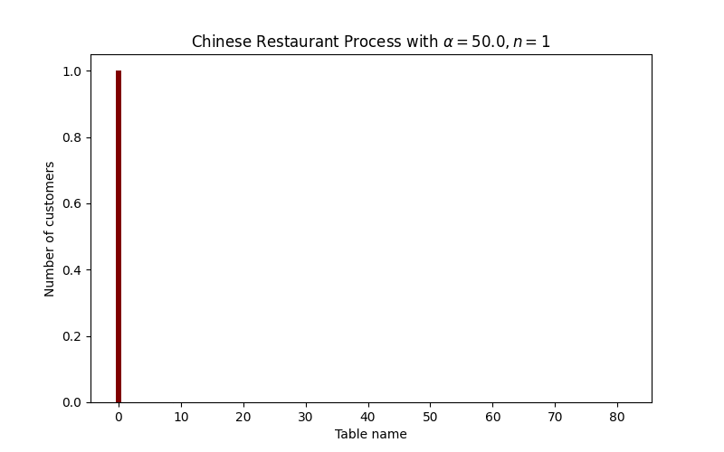

## Motivation

The Chinese Restaurant Process (CRP) is a Bayesian nonparametric method which has uses in clustering microarray gene expression data [@10.1093/bioinformatics/btl284], in population genetics [@doi:10.4137/EBO.S6761] and in modelling response time in cognitive processes [@gershman2011tutorial]. Many of the successful techniques which have proven to work for this type of data (such as Gibbs sampling, Markov chain Monte Carlo or hidden Markov models) rely on previous knowledge about the data such as the number of clusters. This can be problematic as microarray data may contain important fluctuation and we may not always know the number of clusters we aim to separate. The CRP provides an alternative method which does not require prior knowledge on the data, and assumes an infinite number of latent clusters.

#### Source Code

The source code which includes a python utility to simulate Chinese Restaurant Processes can be found on [github](https://github.com/jackpotrykus/chinese-restaurant-process).

## Method

### Overview

A Chinese restaurant is composed of an infinite number of tables. Suppose that customers enter the restaurant. Let $\alpha \in \mathbb{R}^+$. The table assignment is done by the CRP using the following algorithm:

- The first customer is assigned to the first table
- The second customer will choose between the first (occupied) table with probability $\frac{1}{1+\alpha}$ and the second table with probability $\frac{\alpha}{1+\alpha}$.
- Each following $n$th customer chooses their table assignment with probability proportional to the number of previous customers sitting at each table (for  occupied tables), and with probability $\frac{\alpha}{n-1+\alpha}$ for the next unoccupied table.

$\alpha$ is called the concentration parameter. As $\alpha$ increases, the CRP will produce more occupied tables and fewer customers per table.

<center>


</center>

### Formulation

Let $\mathbf{c}_{n}$ be the table assigned to the $n$th customer, $m_k$ the number of customers sitting at table $k$ and $K_+$ the number of occupied tables.

$$P\left(c_{n}=k \mid \mathbf{c}_{1: n-1}\right) \propto\left\{\begin{array}{ll}
\frac{m_{k}}{n-1+\alpha} & \text { if } k \le K_+ \\
\frac{\alpha}{n-1+\alpha} & \text { if } k \text { is the next unoccupied table}
\end{array}\right.$$

The CRP is an exchangeable process, as $p(c)$ does not depend on the order in which customers arrive. The proof can be found in [@gershman2011tutorial].

### Mixture Models

The CRP is used as an infinite mixture model, as it allows grouping of data into an infinite number of clusters. A common algorithm consists in a Gibbs sampler initialized which can be initialized with a random number of clusters [@10.1093/bioinformatics/btl284], or given a prior [@gershman2011tutorial]. We then iterate over each data point and reassign them to the cluster in which they are most likely to belong, or if it is more likely to be in a new cluster alone. The algorithm is run until convergence.

The prior expected number of clusters $K^+$ grows logarithmically with the number of customers $N$ and is controlled by the concentration parameter $\alpha$, with the condition that $\alpha < \frac{N}{\log N}$:

$$\mathbb{E}\left[K_{+}\right]=\alpha \log N$$

Let $y_n$ be our observed data, $\theta_k$ be the cluster parameter associated with table $k$, $c_n$ be each cluster created by the algorithm. We choose $P\left(c_{n+1} \mid \mathbf{c}_{1: n}\right)$ to be our prior for the process. We are able to study the likely partitioning of the data and evaluate the posterior predictive distribution to produce the clusters:

$$P\left(y_{n+1} \mid \mathbf{y}_{1: n}\right)=\sum_{\mathbf{c}_{1: n+1}} \int_{\theta} P\left(y_{n+1} \mid c_{n+1}, \theta\right) P\left(c_{n+1} \mid \mathbf{c}_{1: n}\right) P\left(\mathbf{c}_{1: n}, \theta \mid \mathbf{y}_{1: n}\right) d \theta$$

## Research Examples

In [@10.1093/bioinformatics/btl284], the authors propose a method based on the CRP to cluster microarray gene expression data. The algorithm used is the Gibbs sampler explained in the Mixture Models section above. The data points here correspond to the genes.

The Chinese restaurant process is not only able to improve the accuracy of the Gibbs sampler, but also facilitates the recognition and clustering of genes that display complex correlation relationships such as time-shifted and/or inverted with others. They obtained rapid convergence of the Gibbs sampler. The following figure displays the cluster assignments for the Yeast galactose dataset.

<center>


</center>

## Using the Python Library

To implement the Process, we created a Python library which exports two classes: `ChineseRestaurantProcess` and `ChineseRestaurantMixture`.
The first class takes the concentration parameter `alpha` as an argument, whereas the second requires `param_prior` and `sampler`, functions which produce the prior distribution for each "table" and draw from the conditional distribution given the table for each "customer", respectively.

Note that the class arguments, attributes, and methods are documented extensively in `package_crp_manualv2.pdf` on the Github.

### Code Examples

The examples below should contextualize the inner workings of the process, as well as the usage of the Python library.

The code block below produces plots and animations of a Chinese Restaurant Process for $\alpha \in \{1, 5, 20, 50\}$.
```python
import os
import numpy as np
from matplotlib import pyplot as plt
from matplotlib.animation import FuncAnimation
from chinese_restaurant_process import ChineseRestaurantProcess

for alpha in np.array([1.0, 5.0, 20.0, 50.0]):
    # Example intialization of ChineseRestaurantProcess with inline .iter() method
    crp = ChineseRestaurantProcess(alpha=alpha).iter(200)

    # Example of ChineseRestaurantProcess.__repr__() method
    print(crp)

    # Example of ChineseRestaurantProcess.visualize() method
    fig = crp.visualize()
    plt.savefig(os.path.join("..", "assets", "tables_a{}.png".format(alpha)))

    # Example of ChineseRestaurantProcess.animate() method
    anim = crp.animate()

    # Uncomment to save anim to a GIF file
    anim.save(
        os.path.join("..", "assets", "tables_a{}.gif".format(alpha)),
        writer="imagemagick",
        fps=30,
    )
```
The resulting animations are below. Notice how the number of tables increases with $\alpha$, holding the sample size fixed.





The code block below produces plots and animations of a Chinese Resetaurant Mixture for $\alpha \in \{1, 5, 20, 50\}$, with (in this case) a normal prior on each $\theta_{i}$ for each table, for which we have $X | \theta_i \sim N(\theta_i, \theta_i^2)$.
```
import os
import numpy as np
from matplotlib import pyplot as plt
from matplotlib.animation import FuncAnimation
from chinese_restaurant_process import ChineseRestaurantMixture

# Parameter prior: in this case, we draw a normal prior for each theta_idx with
# mean 10 + idx and standard devation 2.5
param_gen = lambda idx: np.random.normal(loc=10 + idx, scale=2.5, size=1)[0]
# Sampler for N(theta, theta^2) family
sampler = lambda param: np.random.normal(loc=param, scale=param, size=1)[0]

# Produce visualizations and animations for several alpha values
for alpha in np.array([1.0, 5.0, 20.0, 50.0]):
    # Initialize the ChineseRestaurantMixture class
    crm = ChineseRestaurantMixture(
        alpha=alpha, param_prior=param_gen, sampler=sampler
    )
    # Sample 400 points from the mixture distribution specified
    crm.sample(400)
    print(crm)

    # Example of ChineseRestaurantProcess.visualize() method
    fig = crm.visualize(clear=True)
    plt.savefig(os.path.join("..", "assets", "mixture_a{}.png".format(alpha)))

    # Example of ChineseRestaurantProcess.animate() method
    anim = crm.animate(clear=True)

    # Uncomment to save anim to a GIF file
    anim.save(
        os.path.join("..", "assets", "mixture_a{}.gif".format(alpha)),
        writer="imagemagick",
        fps=30,
    )
```

The animations produced by the above code snippet are displayed below, to provide intuition to the effect of $\alpha$ on the resulting mixture-density estimate.


This mixture of normals is meant to be a familiar example, but the class is very flexible. Indeed, `param_prior` can be any function which maps any natural number $n$ to a draw from the prior distribution for $\theta_n$, and `sampler` can be any function which returns a draw from the conditional distribution given the parameter.

As an example of a more "advanced" usage, one could write a prior which returns a $k$-vector/tuple of parameters, pass this vector of parameters as the lone argument to the `sampler` function, and then unpack this vector of parameters in the body of the `sampler` function; this is all to say that the `ChineseRestaurantMixture` class is highly flexible and supports an arbitrary number of parameters $k$.

## Exercises

1. Show that the expected number of tables is $\mathbb{E}\left[K_{+}\right]=\alpha \log N$, for $\alpha < \frac{N}{\log N}$.
2. Prove the exchangeability property of the Chinese Random Process.

#### Sources
